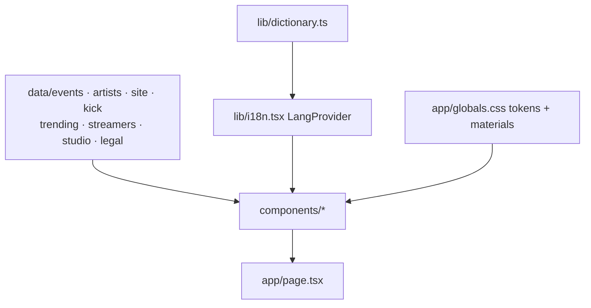

# Architecture

Three static routes: `/` (the landing page), `/privacidad` and `/terminos` (legal, via `components/LegalPage.tsx`). Content comes from typed data files; copy comes from a bilingual dictionary; components read both through a client-side language context.

## Folders
- `app/`: `layout.tsx` (fonts, metadata, `LangProvider`, `CookieBanner`), `page.tsx` (section order), `privacidad/` and `terminos/` (legal routes), `globals.css` (tokens, materials, motion).
- `components/`: one file per section, in page order: [[Hero]], [[Agenda]], [[Trending]], [[Artists]] (`Roster.tsx`), [[Streamers]], [[Kick section]], [[La forja]] (`ForgeProcess.tsx`), [[Studio]], [[Demo form]]; plus `SiteNav.tsx`, `SiteFooter.tsx`, `LegalPage.tsx`, `CookieBanner.tsx` and `icons.tsx` (hand-drawn SVG icons).
- `data/`: content. `events.ts` (agenda + heat helpers), `artists.ts`, `streamers.ts`, `trending.ts`, `kick.ts`, `studio.ts` (prices, slots), `legal.ts` (privacy and terms text), `site.ts` (contact email, Kick, socials).
- `lib/`: `dictionary.ts` (all ES/EN copy), `i18n.tsx` (`LangProvider`, `useLang`, `useNow`, date/countdown formatting in `America/Bogota`), `ics.ts` (add-to-calendar files), `eventPhoto.ts` (picture lookup for an event), `demo.ts` (`sendDemo`, mailto for now), `booking.ts` (`requestBooking`, a stub).
- `public/`: logo, photos by folder (`lentino/`, `RS/`, `leolugo/`, `triana/`, `kick/`), trending clips (`trending/`), hero video and poster.

## Key mechanisms
- **Heat as state**: `heatOf(event, now)` → `live | white | hot | warm | embers | cold` and `heatLevel()` 0–1. Drives colours (`[data-heat]` CSS variables `--h`/`--h2`) across the agenda, hero and artist stage. See [[Design system]].
- **Main vs secondary events**: `featured: true` events are "main" (hero panel); `nextMain()` / `nextSecondary()` in `data/events.ts`. See [[Main and secondary events]].
- **Hydration-safe time**: `useNow()` returns `null` until mount so server and client markup match; countdown blocks own their own 1 s tick.
- **i18n**: client-side; Spanish default, choice stored in `localStorage` (`fmr-lang`), `<html lang>` updated. See [[Bilingual copy]].
- **Scroll choreography**: CSS scroll-driven animations only (view timelines, compositor properties, off under reduced motion): media blocks are forged in, photos drift, the hero sinks away, Kick posters float. Sections hosting timelines use `overflow: clip`. See `DESIGN.md`.
- **Consent**: `CookieBanner` stores `fmr-consent` in localStorage; the footer reopens it.
- **Performance**: hero video pauses off-screen; agenda cards use a pre-blurred copy of their photo instead of live `backdrop-filter`; the photo heat sweep animates `transform` only. See [[Performance pass]].
